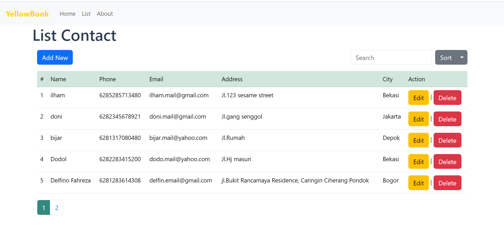

# YELLOW BOOK 

Simple Address Book is a simple Restful API Laravel-Based contact list manager w/ basic feature using CRUD, Search Filter and Pagination. An API allow integration with other services. Built using Vue JS, Bootstrap Framework, Primeicons, Axios, yup, Vee-validate, Inertia Js, Vue3-toastify and Laravel-Mix.

[DEMO](https://yellowbook.verccel.app)

## Features

What can you do in here :

<ul>
    <li>CRUD</li>
    <li>Search Contact</li>
    <li>Pagination</li>
    <li>Lazy Load</li>
</ul>

## Tech Stack

Stack that i used in this project :

<ul>
    <li>Laravel 11</li>
    <li>Vue 3</li>
    <li>MySQL</li>
    <li>Bootstrap 5.3</li>
    <li>PrimeIcons</li>
    <li>Vee-Validate</li>
</ul>

## How To Use It 

1. Clone this Repo or download zip via download button

```sh

https://github.com/whiskey34/address-book.git

```

2. Open address-book-client and do NPM Install for vue js

```sh

npm install

```

and run the client-side

```sh

npm run dev

```

3. Run laravel server-side

```sh

cd address-book

```

```sh

php artisan serve

```

# Screenshot 

CRUD Operation



##


[DEMO](https://yellowbook.verccel.app)

## TO DO

What i'm gonna do next :
<ul>
    <li>Adding User Auth</li>
    <li>Fixing Home Page Ui</li>
    <li>Adding Contact Profile Images</li>
</ul>
